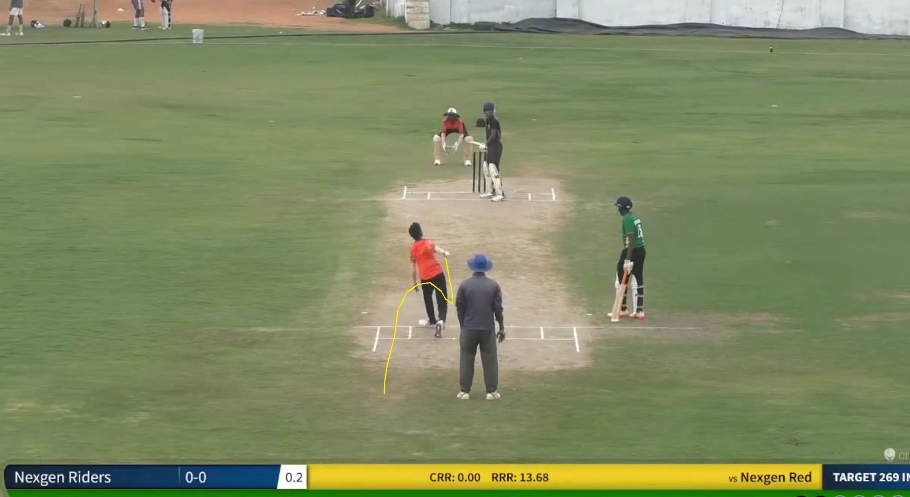
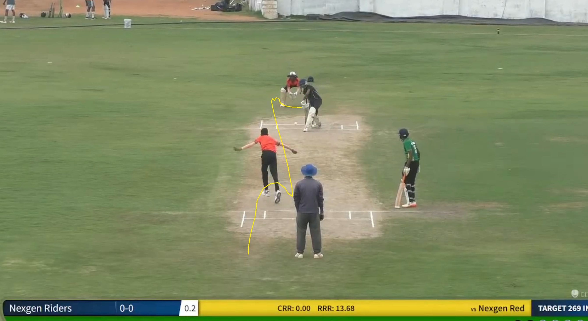
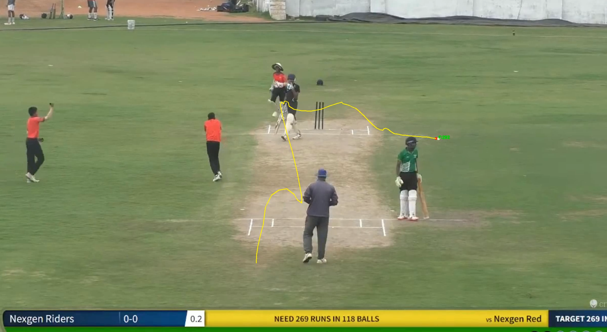
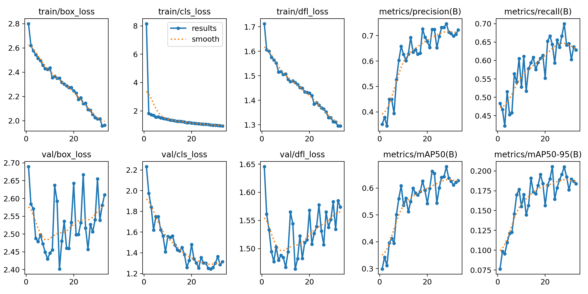

# Cricket Ball Trajectory Tracking

A computer vision system for detecting and tracking cricket balls in video footage using YOLOv8 object detection with custom trajectory filtering and smoothing algorithms.

## Table of Contents
- [Overview](#overview)
- [Pipeline Architecture](#pipeline-architecture)
- [Setup Instructions](#setup-instructions)
- [Dependencies](#dependencies)
- [Usage](#usage)
- [Project Structure](#project-structure)
- [Model Information](#model-information)
- [Hyperparameter Calibration](#hyperparameter-calibration)
- [Results](#results)
- [Technical Approach](#technical-approach)

## Overview

This project implements an end-to-end pipeline for detecting and tracking cricket balls in video footage. The system uses a fine-tuned YOLOv8 model for ball detection, followed by advanced trajectory filtering using Dynamic Programming and Savitzky-Golay smoothing for accurate trajectory visualization.

## Pipeline Architecture

```
Input Video → Ball Detection (YOLOv8) → Trajectory Filtering (DP) → Smoothing (Savgol) → Output Video + CSV
```

**Key Steps:**
1. **Detection Pass**: Detect ball position in each frame using fine-tuned YOLOv8
2. **Filtering Pass**: Select valid trajectory points using Dynamic Programming
3. **Smoothing Pass**: Apply Savitzky-Golay filter to smooth the trajectory
4. **Rendering Pass**: Generate annotated video with trajectory overlay and CSV output

## Setup Instructions

### 1. Clone the Repository
```bash
git clone https://github.com/jayanth260/cricketball_trajectory.git
cd cricketball_trajectory
```

### 2. Create Virtual Environment (Recommended)
```bash
python -m venv venv
source venv/bin/activate  # On Linux/Mac
# or
venv\Scripts\activate  # On Windows
```

### 3. Install Dependencies
```bash
pip install -r requirements.txt
```

## Dependencies

Create a `requirements.txt` file with:
```
ultralytics>=8.0.0
opencv-python>=4.8.0
numpy>=1.24.0
pandas>=2.0.0
scipy>=1.10.0
tqdm>=4.65.0
torch>=2.0.0
torchvision>=0.15.0
```

**System Requirements:**
- Python 3.8+
- CUDA-capable GPU (recommended for training and inference)
- 8GB+ RAM
- 10GB+ free disk space

## Usage

### Training a Model

To train or fine-tune a YOLOv8 model on your cricket ball dataset:

```bash
python code/finetune.py --model yolov8n.pt --data /path/to/data.yaml --project ./models
```

**Arguments:**
- `--model`: Base YOLO model to use (default: `yolov8n.pt`)
- `--data`: Path to dataset configuration YAML file (default: `/content/dataset/data.yaml`)
- `--project`: Path to save trained models (default: `./project`)
- `--resume`: Path to checkpoint to resume training (optional)

**Example:**
```bash
# Start fresh training
python code/finetune.py --model yolov8s.pt --data ./dataset/data.yaml --project ./models

# Resume from checkpoint
python code/finetune.py --resume ./models/cricket_ball_detector/weights/last.pt --project ./models
```

### Processing Videos

To detect and track cricket balls in video footage:

```bash
python track.py --video /path/to/video.mp4 --model /path/to/model.pt
```

**Arguments:**
- `--video`: Path to input video file (required)
- `--model`: Path to trained YOLO model (required)
- `--output_video_dir`: Directory for output videos (default: `./output_videos`)
- `--output_csv_dir`: Directory for trajectory CSV files (default: `./output_csv`)
- `--class_id`: Target class ID to detect (default: `0`)
- `--conf`: Confidence threshold (default: `0.1`)

**Example:**
```bash
python track.py \
  --video ./videos/cricket_match.mp4 \
  --model ./models/best.pt \
  --output_video_dir ./results/videos \
  --output_csv_dir ./results/csv \
  --conf 0.15
```

### Output

The pipeline generates:
- **Processed Video**: Annotated video with ball detection markers and trajectory overlay
- **CSV File**: Frame-by-frame trajectory data with columns: `frame`, `x`, `y`, `visible`

## Project Structure

```
cricketball_trajectory/
├── code/
│   ├── finetune.py          # Model training script
│   └── track.py             # Video processing and tracking script
├── examples/                # Example annotated frames
│   ├── frame_0075.png
│   ├── frame_0150.png
│   └── frame_0200.png
├── models/                  # Trained model weights
│   └── best.pt              # Fine-tuned YOLOv8s model
├── results/                 # Processed videos with trajectories
├── annotations/             # Trajectory data in CSV format
├── README.md                # This file
├── requirements.txt         # Python dependencies
├── results.png              # Training results visualization
└── report.pdf               # Detailed project report
```

## Model Information

### Training Configuration

**Model Architecture**: YOLOv8s (small variant)
- **Base Model**: YOLOv8s pretrained on COCO
- **Input Size**: 1280x1280 pixels
- **Batch Size**: 16
- **Epochs**: 100 (with early stopping)
- **Device**: CUDA GPU

**Training Hyperparameters:**
- **Optimizer**: AdamW
- **Learning Rate (initial)**: 0.001
- **Learning Rate (final)**: 0.01
- **Dropout**: 0.05
- **Patience**: 10 epochs (early stopping)

**Augmentation:**
- Random augmentation enabled
- Mosaic augmentation: 0.0 (disabled for better ball detection)
- Standard YOLO augmentations applied

**Dataset**
- Using the dataset: "https://universe.roboflow.com/mehul-zhiou/cricket-ball-detection-shpqu" for finetuning the pretrained YOLOv8s.

### Model Files

The trained model file required to replicate results is available:
- **Location**: `./models/best.pt`
- **Size**: ~12MB
- **Format**: PyTorch (.pt)
- **Download**: [Link to model file if hosted separately]

## Hyperparameter Calibration

### Detection Parameters

| Parameter | Initial | Final | Reasoning |
|-----------|---------|-------|-----------|
| Image Size | 640 | 1280 | Videos are ~2000x1000px; larger size captures more detail |
| Model | YOLOv8n | YOLOv8s | Better accuracy for small object detection |
| Confidence | 0.25 | 0.1 | Lower threshold to catch all ball instances |
| Batch Size | 32 | 16 | Reduced for larger image size (memory constraints) |

### Trajectory Filtering Parameters

**Dynamic Programming Constraints:**
- `dx_min`: 1 pixel (minimum horizontal movement)
- `dx_max`: 60 pixels (maximum horizontal movement per frame)
- `dy_min`: 1 pixel (minimum vertical movement)
- `dy_max`: 60 pixels (maximum vertical movement per frame)
- `dx_limit`: 200 pixels (absolute maximum to prevent outliers)
- `dy_limit`: 200 pixels (absolute maximum to prevent outliers)

**Smoothing Parameters:**
- **Window Length**: 9 frames
- **Polynomial Order**: 2 (quadratic fit)
- **Filter**: Savitzky-Golay

### Results Summary if detection

| Metric | Value |
|--------|-------|
| Training mAP@50 | ~0.66 |
| Training mAP@50-95 | ~0.187 |

## Results

### Processed Videos

Final processed videos with trajectory overlays are available in the `results/` folder:
- Videos show frame-by-frame ball detection with connected trajectory path
- Each video includes ball position markers and complete trajectory overlay

### Example Annotated Frames

Sample frames showing detection and trajectory:

**Early Trajectory**


**Mid-flight Tracking**


**Complete Trajectory Arc**


### Training Logs
The below plots give a detailed analysis of training phase:

## Technical Approach

### Problem Evolution

1. **Initial Challenge**: Direct centroid connection created invalid trajectories when ball wasn't detected
2. **Model Upgrade**: Switched from YOLOv8n (640px) to YOLOv8s (1280px) for better high-resolution detection
3. **False Positive Handling**: Difficult to distinguish valid detections from noise
4. **Starting Point Problem**: No reliable way to identify first valid ball position
5. **Solution**: Detect all high-confidence positions, then post-process to extract valid trajectory

### Dynamic Programming Approach

The trajectory filtering problem is formulated as: *"Given a set of detected points, find the subset that forms the longest valid trajectory"*

- **State**: `dp[i]` = (longest valid path ending at point i, previous point index)
- **Transition**: Point j → Point i is valid if motion constraints are satisfied
- **Constraints**: 1 < Δx,Δy < 60 and Δx,Δy < 200
- **Reconstruction**: Backtrack from longest path endpoint

This approach guarantees finding the globally optimal trajectory path, avoiding greedy algorithm pitfalls.

### Smoothing Strategy

Savitzky-Golay filter applied to valid trajectory points:
- Preserves trajectory shape better than moving average
- Polynomial fitting reduces jitter while maintaining physical plausibility
- Window size balances smoothness vs. responsiveness

## Development Notes

### Key Challenges Solved

1. **High-Resolution Videos**: Upgraded to 1280px input size for 2000x1000 videos
2. **Occlusion Handling**: DP algorithm bridges gaps when ball is temporarily occluded
3. **False Positives**: Motion constraints filter non-physical detections
4. **Trajectory Continuity**: Global optimization ensures best continuous path

### Future Improvements

- Kalman filter integration for predictive tracking
- Multi-ball tracking support
- Real-time processing optimization
- 3D trajectory reconstruction using calibrated cameras

## Author

Jayanth - [GitHub](https://github.com/jayanth260)
